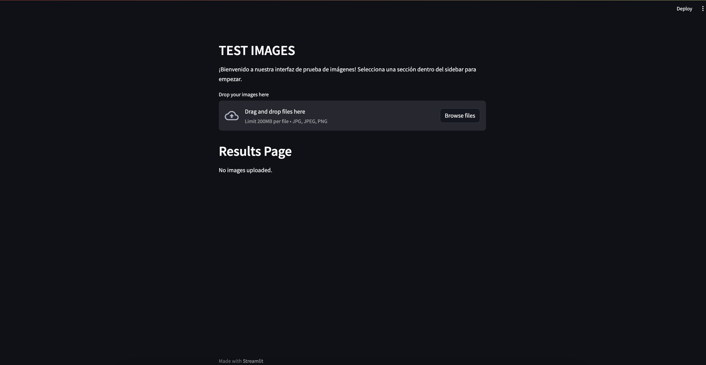

# BoshHackathon2023

Vision.io es un proyecto de procesamiento de imágenes para Cámaras de Visión Trasera que busca asegurar y verificar la correcta orientación, centrado, iluminación y nitidez de la cámara.

## UX
Para la user interface utilizamos Streamlit a free open-source framework to rapidly build and share web apps. It is a Python-based library
